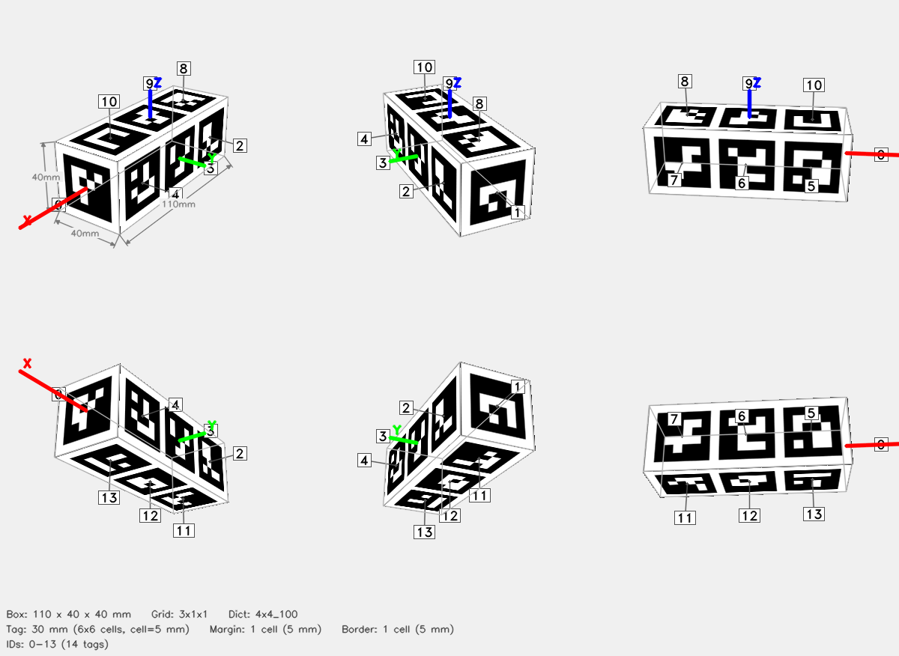

# ArUco Cube — 3x1x1



## Parameters

| Parameter | Value |
|-----------|-------|
| Dictionary | `4x4_100` |
| Grid | 3x1x1 (X x Y x Z tags) |
| Box dimensions | 110 x 40 x 40 mm |
| Tag size | 30 mm (6x6 cells) |
| Cell size | 5 mm |
| Margin | 1 cell (5 mm) |
| Border | 1 cell (5 mm) |
| Total tags | 14 |
| Tag IDs | 0–13 |

## Face Layout

| Face | Tag IDs |
|------|---------|
| +X | 0 |
| -X | 1 |
| +Y | 2, 3, 4 |
| -Y | 5, 6, 7 |
| +Z | 8, 9, 10 |
| -Z | 11, 12, 13 |

## Files

| File | Description |
|------|-------------|
| `cube.3mf` | Multi-color 3MF for Bambu Studio |
| `config.json` | Detector config (used by `detect_cube.py`) |
| `thumbnail.png` | 6-view preview |
| `mujoco/cube.xml` | MuJoCo MJCF model |
| `mujoco/cube.obj` | Wavefront OBJ mesh (UV-mapped) |
| `mujoco/cube.mtl` | OBJ material file |
| `mujoco/cube_atlas.png` | Texture atlas |

## Config JSON

```json
{
  "dict": "4x4_100",
  "grid": "3x1x1",
  "tag_ids": [
    0,
    1,
    2,
    3,
    4,
    5,
    6,
    7,
    8,
    9,
    10,
    11,
    12,
    13
  ],
  "faces": {
    "+X": [
      0
    ],
    "-X": [
      1
    ],
    "+Y": [
      2,
      3,
      4
    ],
    "-Y": [
      5,
      6,
      7
    ],
    "+Z": [
      8,
      9,
      10
    ],
    "-Z": [
      11,
      12,
      13
    ]
  },
  "tag_size_mm": 30.0,
  "cell_size_mm": 5.0,
  "margin_cells": 1,
  "border_cells": 1,
  "marker_pixels": 6,
  "box_dims": [
    110.0,
    40.0,
    40.0
  ]
}
```

## Regenerate

```bash
python generate_cube.py --grid 3x1x1 --dict 4x4_100 --tag-size 30 --margin-cell 1 --border-cell 1 -o 3x1x1_30_cube
```
