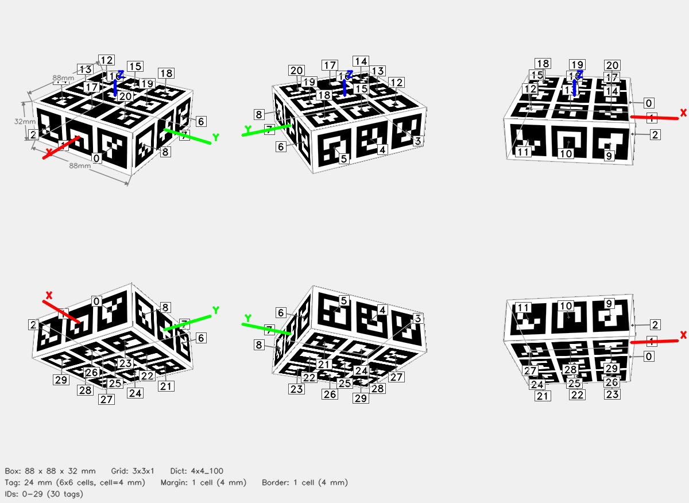

# ArUco Cube — 3x3x1



## Parameters

| Parameter | Value |
|-----------|-------|
| Dictionary | `4x4_100` |
| Grid | 3x3x1 (X x Y x Z tags) |
| Box dimensions | 88 x 88 x 32 mm |
| Tag size | 24 mm (6x6 cells) |
| Cell size | 4 mm |
| Margin | 1 cell (4 mm) |
| Border | 1 cell (4 mm) |
| Total tags | 30 |
| Tag IDs | 0–29 |

## Face Layout

| Face | Tag IDs |
|------|---------|
| +X | 0, 1, 2 |
| -X | 3, 4, 5 |
| +Y | 6, 7, 8 |
| -Y | 9, 10, 11 |
| +Z | 12, 13, 14, 15, 16, 17, 18, 19, 20 |
| -Z | 21, 22, 23, 24, 25, 26, 27, 28, 29 |

## Files

| File | Description |
|------|-------------|
| `cube.3mf` | Multi-color 3MF for Bambu Studio |
| `config.json` | Detector config (used by `detect_cube.py`) |
| `thumbnail.png` | 6-view preview |
| `mujoco/cube.xml` | MuJoCo MJCF model |
| `mujoco/cube.obj` | Wavefront OBJ mesh (UV-mapped) |
| `mujoco/cube.mtl` | OBJ material file |
| `mujoco/cube_atlas.png` | Texture atlas |

## Config JSON

```json
{
  "dict": "4x4_100",
  "grid": "3x3x1",
  "tag_ids": [
    0,
    1,
    2,
    3,
    4,
    5,
    6,
    7,
    8,
    9,
    10,
    11,
    12,
    13,
    14,
    15,
    16,
    17,
    18,
    19,
    20,
    21,
    22,
    23,
    24,
    25,
    26,
    27,
    28,
    29
  ],
  "faces": {
    "+X": [
      0,
      1,
      2
    ],
    "-X": [
      3,
      4,
      5
    ],
    "+Y": [
      6,
      7,
      8
    ],
    "-Y": [
      9,
      10,
      11
    ],
    "+Z": [
      12,
      13,
      14,
      15,
      16,
      17,
      18,
      19,
      20
    ],
    "-Z": [
      21,
      22,
      23,
      24,
      25,
      26,
      27,
      28,
      29
    ]
  },
  "tag_size_mm": 24.0,
  "cell_size_mm": 4.0,
  "margin_cells": 1,
  "border_cells": 1,
  "marker_pixels": 6,
  "box_dims": [
    88.0,
    88.0,
    32.0
  ]
}
```

## Regenerate

```bash
python generate_cube.py --grid 3x3x1 --dict 4x4_100 --tag-size 24 --margin-cell 1 --border-cell 1 -o 3x3x1_24_cube
```
