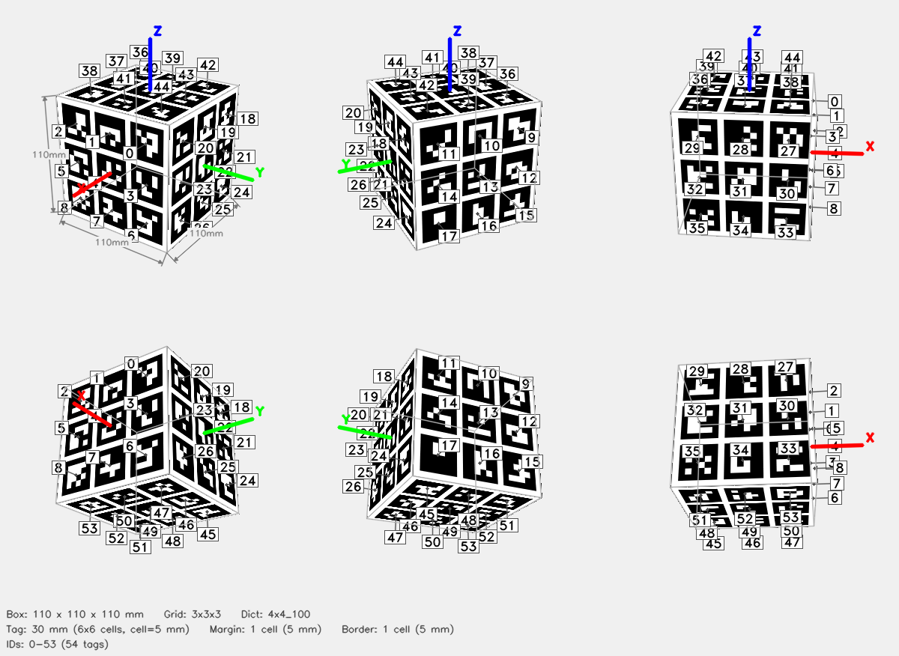

# ArUco Cube — 3x3x3



## Parameters

| Parameter | Value |
|-----------|-------|
| Dictionary | `4x4_100` |
| Grid | 3x3x3 (X x Y x Z tags) |
| Box dimensions | 110 x 110 x 110 mm |
| Tag size | 30 mm (6x6 cells) |
| Cell size | 5 mm |
| Margin | 1 cell (5 mm) |
| Border | 1 cell (5 mm) |
| Total tags | 54 |
| Tag IDs | 0–53 |

## Face Layout

| Face | Tag IDs |
|------|---------|
| +X | 0, 1, 2, 3, 4, 5, 6, 7, 8 |
| -X | 9, 10, 11, 12, 13, 14, 15, 16, 17 |
| +Y | 18, 19, 20, 21, 22, 23, 24, 25, 26 |
| -Y | 27, 28, 29, 30, 31, 32, 33, 34, 35 |
| +Z | 36, 37, 38, 39, 40, 41, 42, 43, 44 |
| -Z | 45, 46, 47, 48, 49, 50, 51, 52, 53 |

## Files

| File | Description |
|------|-------------|
| `cube.3mf` | Multi-color 3MF for Bambu Studio |
| `config.json` | Detector config (used by `detect_cube.py`) |
| `thumbnail.png` | 6-view preview |
| `mujoco/cube.xml` | MuJoCo MJCF model |
| `mujoco/cube.obj` | Wavefront OBJ mesh (UV-mapped) |
| `mujoco/cube.mtl` | OBJ material file |
| `mujoco/cube_atlas.png` | Texture atlas |

## Config JSON

```json
{
  "dict": "4x4_100",
  "grid": "3x3x3",
  "tag_ids": [
    0,
    1,
    2,
    3,
    4,
    5,
    6,
    7,
    8,
    9,
    10,
    11,
    12,
    13,
    14,
    15,
    16,
    17,
    18,
    19,
    20,
    21,
    22,
    23,
    24,
    25,
    26,
    27,
    28,
    29,
    30,
    31,
    32,
    33,
    34,
    35,
    36,
    37,
    38,
    39,
    40,
    41,
    42,
    43,
    44,
    45,
    46,
    47,
    48,
    49,
    50,
    51,
    52,
    53
  ],
  "faces": {
    "+X": [
      0,
      1,
      2,
      3,
      4,
      5,
      6,
      7,
      8
    ],
    "-X": [
      9,
      10,
      11,
      12,
      13,
      14,
      15,
      16,
      17
    ],
    "+Y": [
      18,
      19,
      20,
      21,
      22,
      23,
      24,
      25,
      26
    ],
    "-Y": [
      27,
      28,
      29,
      30,
      31,
      32,
      33,
      34,
      35
    ],
    "+Z": [
      36,
      37,
      38,
      39,
      40,
      41,
      42,
      43,
      44
    ],
    "-Z": [
      45,
      46,
      47,
      48,
      49,
      50,
      51,
      52,
      53
    ]
  },
  "tag_size_mm": 30.0,
  "cell_size_mm": 5.0,
  "margin_cells": 1,
  "border_cells": 1,
  "marker_pixels": 6,
  "box_dims": [
    110.0,
    110.0,
    110.0
  ]
}
```

## Regenerate

```bash
python generate_cube.py --grid 3x3x3 --dict 4x4_100 --tag-size 30 --margin-cell 1 --border-cell 1 -o 3x3x3_30_cube
```
