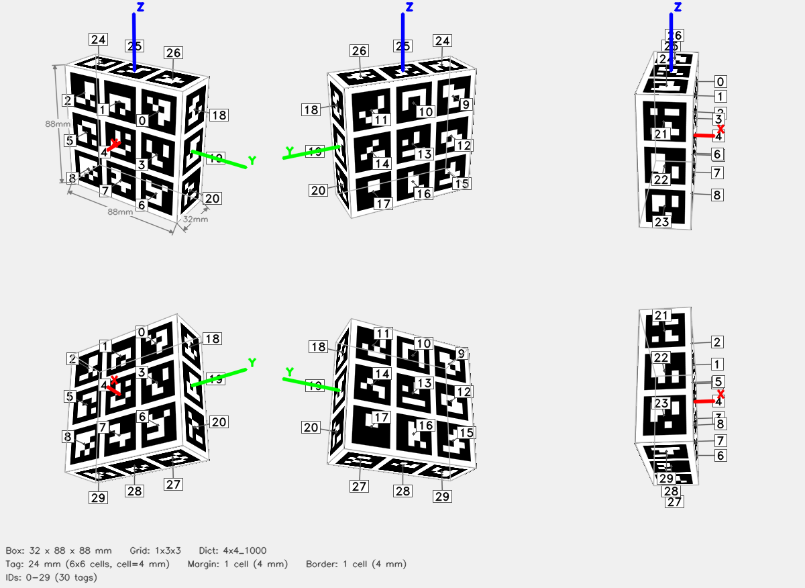

# ArUco Cube — 1x3x3



## Parameters

| Parameter | Value |
|-----------|-------|
| Dictionary | `4x4_1000` |
| Grid | 1x3x3 (X x Y x Z tags) |
| Box dimensions | 32 x 88 x 88 mm |
| Tag size | 24 mm (6x6 cells) |
| Cell size | 4 mm |
| Margin | 1 cell (4 mm) |
| Border | 1 cell (4 mm) |
| Total tags | 30 |
| Tag IDs | 0–29 |
| Attachment | +Z end-effector connector, rod 50 mm x r10 mm |

## Face Layout

| Face | Tag IDs |
|------|---------|
| +X | 0, 1, 2, 3, 4, 5, 6, 7, 8 |
| -X | 9, 10, 11, 12, 13, 14, 15, 16, 17 |
| +Y | 18, 19, 20 |
| -Y | 21, 22, 23 |
| +Z | 24, 25, 26 |
| -Z | 27, 28, 29 |

## Files

| File | Description |
|------|-------------|
| `cube.3mf` | Multi-color 3MF for Bambu Studio |
| `config.json` | Detector config (used by `detect_cube.py`) |
| `thumbnail.png` | 6-view preview |
| `mujoco/cube.xml` | MuJoCo MJCF model |
| `mujoco/cube.obj` | Wavefront OBJ mesh (UV-mapped) |
| `mujoco/cube.mtl` | OBJ material file |
| `mujoco/cube_atlas.png` | Texture atlas |

## Config JSON

```json
{
  "schema_version": 1,
  "target": {
    "type": "cuboid",
    "grid": "1x3x3"
  },
  "dict": "4x4_1000",
  "grid": "1x3x3",
  "tag_ids": [
    0,
    1,
    2,
    3,
    4,
    5,
    6,
    7,
    8,
    9,
    10,
    11,
    12,
    13,
    14,
    15,
    16,
    17,
    18,
    19,
    20,
    21,
    22,
    23,
    24,
    25,
    26,
    27,
    28,
    29
  ],
  "faces": {
    "+X": [
      0,
      1,
      2,
      3,
      4,
      5,
      6,
      7,
      8
    ],
    "-X": [
      9,
      10,
      11,
      12,
      13,
      14,
      15,
      16,
      17
    ],
    "+Y": [
      18,
      19,
      20
    ],
    "-Y": [
      21,
      22,
      23
    ],
    "+Z": [
      24,
      25,
      26
    ],
    "-Z": [
      27,
      28,
      29
    ]
  },
  "tag_size_mm": 24.0,
  "cell_size_mm": 4.0,
  "margin_cells": 1,
  "border_cells": 1,
  "marker_pixels": 6,
  "box_dims": [
    32.0,
    88.0,
    88.0
  ],
  "attachment": {
    "type": "end_effector_connector",
    "axis": "+Z",
    "connector_stl": "assets/end_effector_connector.stl",
    "connector_rotation_degrees": [
      180.0,
      0.0,
      0.0
    ],
    "rod_length_mm": 50.0,
    "rod_radius_mm": 10.0,
    "overlap_mm": 1.0,
    "rod_segments": 64,
    "surface_z_mm": 44.0,
    "rod_start_z_mm": 44.0,
    "rod_end_z_mm": 94.0,
    "connector_bounds_mm": [
      [
        -37.0,
        -37.0,
        94.0
      ],
      [
        37.0,
        37.0,
        109.0
      ]
    ],
    "mesh_bounds_mm": [
      [
        -37.0,
        -37.0,
        43.0
      ],
      [
        37.0,
        37.0,
        109.0
      ]
    ],
    "triangle_count": 6372,
    "connector_triangle_count": 6116,
    "rod_triangle_count": 256,
    "connector_vertex_count": 18348
  }
}
```

## Regenerate

```bash
aprilcube generate --grid 1x3x3 --dict 4x4_1000 --tag-size 24 --margin-cell 1 --border-cell 1 --end-effector-connector --connector-rod-length 50 --connector-rod-radius 10 -o calibration_cube
```
